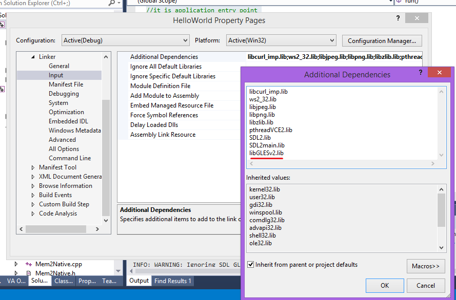

#Эмуляция OpenGLES через Direct3D

Для того чтобы включить обязательное создание OpenGLES контекста надо установить флаг **force_gles** в структуре **oxygine::core::init_desc** в **true** перед инициализацией Oxygine.
	
    //initialize Oxygine's internal stuff
    core::init_desc desc;
	desc.title = "My Application";
	desc.w = 960;
	desc.h = 640;

	desc.force_gles = true;

    core::init(&desc);

Флаг **force_gles** имеет смысл применять в паре с библиотекой **Angle**.

##Angle

The goal of [ANGLE](https://code.google.com/p/angleproject/) is to allow Windows users to seamlessly run WebGL and other OpenGL ES 2.0 content by translating OpenGL ES 2.0 API calls to DirectX 9 or DirectX 11 API calls.

Первым делом нужно скомпилировать Angle и вы получите 4 основных файла:

* libGLESv2.lib
* libGLESv2.dll
* libEGL.dll
* d3dcompiler_47.dll

**dll** файлы скопируйте в папку data. А **libGLESv2.lib** в **oxygine-framework/libs/**

Если вы компилируете библиотеки самостоятельно, то придется чуть-чуть подправить код в файле **SDL/src/video/windows/SDL_windowsopengl.c**.
Найти строку:
	
	_this->gl_data->HAS_WGL_EXT_create_context_es2_profile = SDL_TRUE;

и закомментировать 	ее:
	
	//_this->gl_data->HAS_WGL_EXT_create_context_es2_profile = SDL_TRUE;

###Visual Studio
В настройках Linker необходимо указать вместо **OpenGL32.lib** библиотеку  **libGLESv2.lib** из Angle. 

###Visual Studio + CMake
Если проект создан с помощью CMake, то укажите флаг **FORCE_GLES=1**, пример:
	

	cmake -G"Visual Studio 12 2013" -DFORCE_GLES=1

	
