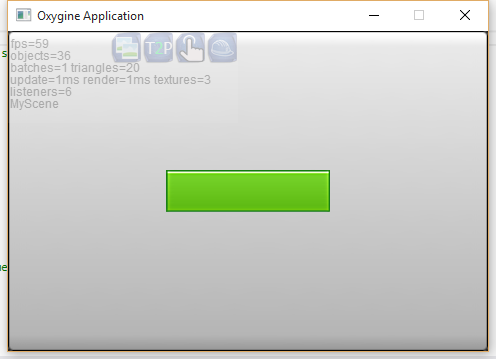
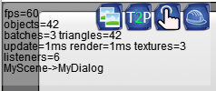

#Oxygine-Flow

https://github.com/oxygine/oxygine-flow

oxygine-flow это расширение для oxygine, позволяющее организовывать удобную систему диалогов/сцен и переходов между ними, построенной на асинхронной модели событий.

Общая функциональность oxygine-flow будет описана на одном примере, начиная с простого и постепенно усложняя его.
За основу примера берется пустой проект по шаблону HelloWorld из oxygine-framework. Работа ведется только в одном файле example.cpp.

> Полностью завершенный пример находится в папке **oxygine-flow\examples\HelloFlow**

> Видео демонстрация работы примера oxygine-flow: https://www.youtube.com/watch?v=Z4p1ol1-cLM&feature=youtu.be

> Веб версия: http://oxygine.org/online_demo.php кнопка *Run Oxygine-Flow example*

Первым делом добавим вызов основных функций и все необходимые нам includes в **example.cpp**:

	#include "oxygine-framework.h"
	#include "flow.h"
	#include "Scene.h"
	#include "Transition.h"
	using namespace oxygine;

	void example_preinit()
	{

	}

	void example_init()
	{
		//initialize oxygine-flow
		flow::init();
	}

	void example_update()
	{
		//update oxygine-flow each frame
	    flow::update();
	}

	void example_destroy()
	{
		//free oxygine-flow
	    flow::free();
	}

##Scene
Основной класс, с которым вы будете иметь дело - это **Scene**.
Необходимо отнаследоваться от него и прикрепить к Актеру **Scene::_holder** все ваши элементы интерфейса.

Cоздадим класс MyScene для нашей простой сцены с кнопкой по центру:
	
	class MyScene : public oxygine::flow::Scene
	{
	public:
		MyScene()
		{
			setName("MyScene");

			spBox9Sprite view = new Box9Sprite;
			_view = view;
			_view->setSize(_holder->getSize());		
			_view->attachTo(_holder);

			spButton btn = new Button;
			btn->setPosition(_view->getSize() / 2 - btn->getSize() / 2);
			btn->attachTo(_view);
		}

		spActor _view;
	};

Покажем MyScene на экране при старте приложения:

	void example_init()
	{
		//initialize oxygine_flow
		flow::init();

		//create scene and display it
	    flow::show(new MyScene);
	}

Пока что кнопка в центре ни на что не реагирует, добавим закрытие сцены (в конструкторе MyScene) при ее нажатии, вызвав метод **Scene::finish()**:

	btn->addEventListener(TouchEvent::CLICK, [=](Event*){
		finish();
		});

> для простоты тут используется lambda
> будьте внимательны: finish() вызывается для класса MyScene

Теперь MyScene будет закрываться при клике на кнопку. Как узнать что сцена закрылась? Один из вариантов передать Callback в метод **flow::show**:

	flow::show(new MyScene, {
		log::messageln("scene closed");
		});

Усложним пример и добавим еще один класс для диалога, который отличается от сцены только установленным флажком **Scene::_dialog**, который сообщает системе о том, что данную сцену надо показывать поверх уже открытой, не скрывая ее на экране:

	class MyDialog: public flow::Scene
	{

	public:
		MyDialog()
		{
			setName("MyDialog");
			
			_dialog = true;

			spBox9Sprite view = new Box9Sprite;
			_view = view;
			_view->setSize(400, 300);
			_view->attachTo(_holder);
			_view->setPosition(_holder->getSize() / 2 - _view->getSize() / 2);

			spButton btn = new Button;
			btn->setPosition(120, 200);
			btn->attachTo(_view);

			btn->addEventListener(TouchEvent::CLICK, [=](Event*) {
				finish();
			});
		}

		spActor _view;
	};

Открытие MyDialog добавим в класс MyScene, в обработчик клика на кнопку, который перепишем таким образом:

	btn->addEventListener(TouchEvent::CLICK, [=](Event*){
			flow::show(new MyDialog, [=](Event*){
				//finish();
				log::messageln("dialog closed");
				});
		});		

Теперь каждый раз при клике по кнопке в MyScene будет открываться MyDialog. Можете раскомментировать *//finish();* выше и тогда после закрытия MyDialog следом закроется и MyScene.

Пока что появление MyDialog на экране выглядит очень просто, сделаем его открытие чуть красивее. Добавим в конструктор MyDialog:

	flow::TransitionMove::assign(this);

Теперь MyDialog будет отображаться плавно выезжая сверху экрана и затеняя под собой MyScene.

##Special Events

Давайте научимся пользоваться некоторыми ключевыми Events, о которых умеет уведомлять класс Scene.
Например, перед каждым показом MyDialog будем менять цвет фона диалога на случайный, добавим в конструктор MyDialog:

	addEventListener(EVENT_PRE_SHOWING, [=](Event*) {
			view->setColor(Color(rand() % 255, rand() % 255, rand() % 255, 255));
		});

А когда он уже окончательно открылся (выехал с края экрана) - плавно сменим цвет на белый, каким он был изначально, добавив в конструктор MyDialog:
	
	addEventListener(EVENT_POST_SHOWING, [=](Event*) {
			view->addTween(Sprite::TweenColor(Color::White), 300);
		});

Аналогичные события есть и на скрытие сцены:

- **EVENT_PRE_HIDING**
- **EVENT_POST_HIDING**

Событие нажатия кнопки Esc/Back (Back для Android):

- **EVENT_BACK**

Добавим обработку EVENT_BACK в конструктор MyDialog, где будем закрывать MyDialog, также как мы это делали по событию CLICK на *btn*:

	addEventListener(EVENT_BACK, [=](Event*) {
			finish();
		});

События оповещающие, что поверх сцены открыли/закрыли другую сцену:

- **EVENT_SCENE_SHOWN**
- **EVENT_SCENE_HIDDEN**

События входа и выхода сцены:

- **EVENT_ENTERING**
- **EVENT_LEAVING**

##Important

- Все открытые сцены хранятся в *Stack*, работающему по принципу *Last In First Out*, открытая Scene всегда ждет, когда к ней будет возвращено управление. Список открытых сцен отображается в DebugActor 
- Если сцена уже открыта, т.е она находится *в стеке открытых сцен*, нельзя ее показать повторно, до тех пор пока вы ее не закрыли (т.е не удалили из Stack). Даже если она сейчас не видна экране.
- Если вам нужно удалить невидимую, но открытую ранее сцену используйте *Scene::remove*.
- Стек с открытыми сценами можно отследить в DebugActor.
- Нельзя (!!!) показывать поверх уже открытого Диалога - Сцену, сначала дождитесь закрытия диалога и из Callback в flow::show покажите свою сцену.
- Все EVENTS, описанные выше логируются. Вы можете отследить их в вашем логе.

##Transitions

В состав oxygine-flow входит небольшой набор разных анимаций перехода между диалогами и сценами:

- TransitionMove - выезд сверху экрана + затенение заднего фона
- TransitionFade - плавное появление через прозрачность
- TransitionShutters - пример перехода со "шторками"
- TransitionQuads - сложный переход "лесенкой"