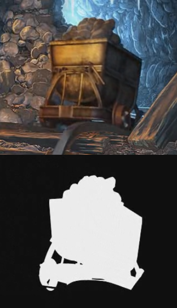

#Movie

[**oxygine-movie**](https://github.com/oxygine/oxygine-movie) this is an extension for Oxygine which allows video playback with alpha channel support. This extension uses the codec [Theora](http://www.theora.org/).

> Theora is a free and open video compression format from the Xiph.org Foundation. Like all our multimedia technology it can be used to distribute film and video online and on disc without the licensing and royalty fees or vendor lock-in associated with other formats.

**oxygine-movie** is dependent on **oxygine-sound**, therefore it must also be installed.

The main class for this extension is **MovieSprite**, which inherits from **Sprite**. You may have as many of them as you wish in a scene, but be aware that it will increase the load on the CPU. The decoding works on a separate thread.

**oxygine-movie** supports the alpha channel which must be saved in the video like this:



[A working example](http://www.youtube.com/watch?v=d-Wf0krGoRU) is located in this folder: oxygine-movie\examples\Movie\

##Usage

Include headers:

	#include "MovieSprite.h"

Initialize the subsystem once before using:

	MovieSprite::init();

Create the sprite with the video and attach it to the scene:

	spMovieSprite movie = MovieSprite::create();
	movie->attachTo(getStage());

Set the path to the video file:

	movie->setMovie("path/to/movie.ogv");

If the video has an alpha channel, then:

	movie->setMovie("path/to/movie.ogv", true);

If you wish to loop the video, then do the following before playing it:

	movie->setLooped(true);	

Playing the video:

	movie->play();	

The video can be paused like this:

	movie->pause();

You can also stop the video entirely like this:

	movie->stop();

You may also add an event listener for when the video ends:
```cpp
	movie->addEventListener(MovieSprite::COMPLETE, CLOSURE(this, &SomeClass::movieDone));

	void SomeClass::movieDone(Event*)
	{
        log::messageln("movie done");
	} 
```

Before exiting the application, remember to delete the subsystem:

    MovieSprite::free();