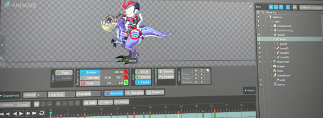

#Spine

[Spine](esotericsoftware.com) is an animation tool that focuses specifically on 2D animation for games. Spine aims to have an efficient, streamlined workflow, both for creating animations and for making use of those animations in games.

Oxygine library for playing Spine animations is available on [bitbucket](https://bitbucket.org/oxygine/oxygine-spine).