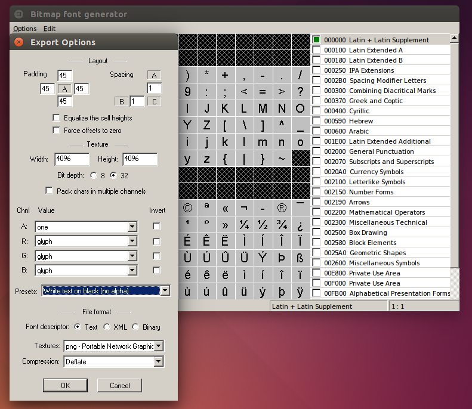
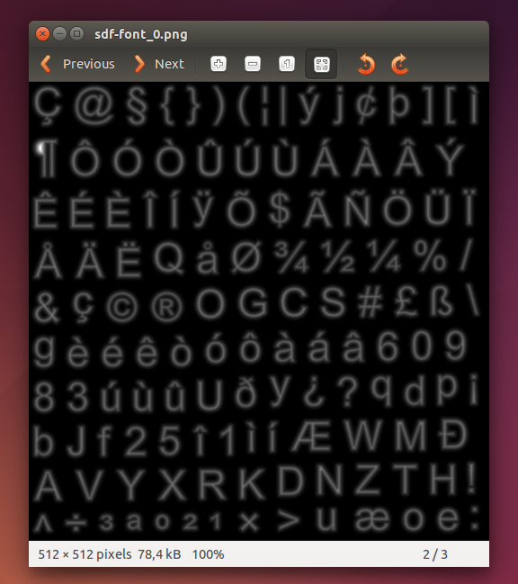
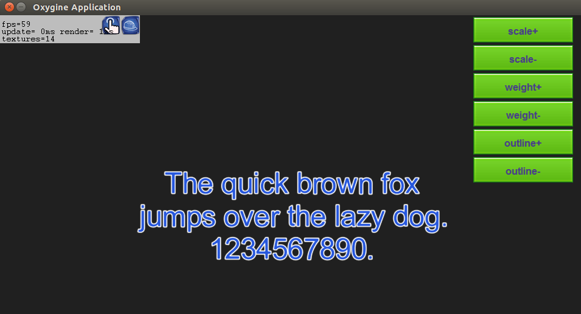

В Oxygine встроена поддержка SDF (Signed Distance Field) шрифтов.
SDF является разновидностью Bitmap шрифтов. SDF позволяет увеличивать размер шрифта без образования заметных артефактов.

# Создание SDF шрифта
SDF шрифт создаётся на основе обычного черно-белого bitmap шрифта (можно создать c помощью [BMFont](http://www.angelcode.com/products/bmfont/)).
Рекомендуется генерировать шрифт размером 400pt, без сглаживания, с отступами 45x45x45x45 и размером картинки 4096x4096. Bit depth: 32.
Полученный шрифт экспортируем в формате png.

На следующем этапе создаем сам SDF шрифт с помощью [ImageMagic](http://www.imagemagick.org/script/index.php) 

    convert font.png -filter Jinc ( +clone -negate -morphology Distance Euclidean -level 50%,-50% ) -morphology Distance Euclidean -compose Plus -composite -level 43%,57% -resize 12.5% font.png
На ubuntu пришлось экранировать скобки (bash).
    
    convert font.png -filter Jinc \( +clone -negate -morphology Distance Euclidean -level 50%,-50% \) -morphology Distance Euclidean -compose Plus -composite -level 43%,57% -resize 12.5% font.png

Размер изображения уменьшился в 8 раз с 4096 до 512. Для корректной работы в Oxygine необходимо, что бы изображения осталось в формате 32-bit-png.

# Загрузка шрифта
Шрифт может быть объявлен в resources.xml:

    <sdfont font="font.fnt" downsample="8" /> 

или загружен во время выполнения:

    sdfont.initSD("sdf/font.fnt", 8);
    sdfont.load();

# Использование
SDF шрифт позволяет изменять размер, жирность и контур без образования заметных артефактов.

    txt->setOutline(myOutline);
    txt->setScale(myScale);
    txt->setWeight(myWeight);

Также для SDF шрифта могут быть применены все настройки стиля, как и для обычного bitmap шрифта.
    
    TextStyle st;
    st.vAlign = TextStyle::VALIGN_MIDDLE;
    st.hAlign = TextStyle::HALIGN_MIDDLE;
    st.color = Color::CornflowerBlue;

    st.multiline = true;

    st.outlineColor = Color::White;

    txt->setStyle(st);
