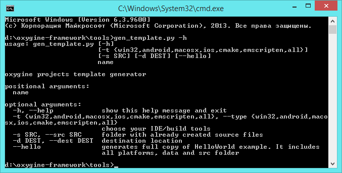

#How To Start
First thing you need to do is download Oxygine. This can be done like so:

1. [Clone](https://github.com/oxygine/) from GitHub the required repositories. You need at least [oxygine-framework](https://github.com/oxygine/oxygine-framework) and [SDL2](https://github.com/oxygine/SDL2). Preferred for MacOSX/Linux users and everyone else. Then, follow the instructions in the folder oxygine-framework/readme.

2. [Download **All-In-One**](http://oxygine.org/download.php). This method works well for quick starting in Windows Visual Studio, as it contains all of the files and compiled libraries required to work with the project right away.

###Examples
Go to **oxygine-framework/examples** folder and open any of the examples.
There are examples:

* **HelloWorld** is a starting point.
* **Game** is a tutorial example. It has 5 parts from beginning to advanced usage.
* **Demo** has tests and demonstration of Oxygine functionality. 
* **DemoBox2D** is a Box2D integration example
* **Match3** is match3 mechanics demonstration implemented with Oxygine.
 
Each example has configuration folders for different platforms/OS:

* **proj.win32** - solution for Visual Studio
* **proj.ios** - iOS XCode/AppCode project
* **proj.macosx** - MacOSX Xcode/AppCode project
* **proj.marmalade** - Marmalade project
* *proj.android* - build folder for Android SDK/NDK
* *proj.cmake* - CMake configuration folder (Windows | Linux)
* *proj.emscripten* - Emscripten configuration folder

> If you encounter any issues or need to build for android, cmake, mingw, emscripten check **oxygine-framework/readme** folder and follow instructions

##Next Steps
Oxygine has some tools written in Python and you need to install them for advanced usage.

* [Download](https://www.python.org/downloads/) and install Python version 2.7.* or 3.*
* [Download](http://www.pythonware.com/products/pil/) and install PIL (Pillow) for Python

[see details](https://github.com/oxygine/oxygine-framework/blob/master/readme/readme.txt)

##Generate project 

You can generate your own project outside of oxygine-framework folder by using the **gen_template.py** tool. It is located in
  
	oxygine-framework/tools/

Run **gen_template.py** script with Python, example:

	python gen_template.py MyProjectName -t win32 -d path/to/MyProject/

It would create empty solution *MyProject* for Visual Studio in the folder *path/to/MyProject*

Next step is add *main.cpp* (copy it from any example) to your project and implement basic functions (example_init, example_update and so on). Also, remember to copy the data folder as well if you are using a ready-made example code to start your project.

Other example (Recommended):

	python gen_template.py MyProjectName -t all --hello -d path/to/MyProject/

It would create full copy of examples/HelloWorld including src, data and proj.* folders.

see for more info: 
	
	python gen_template.py --help